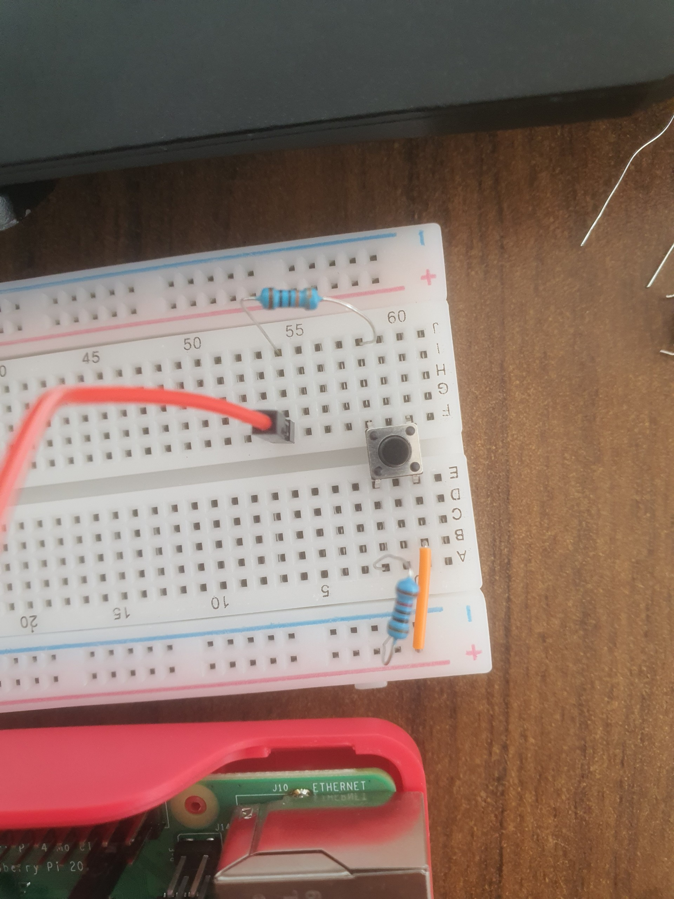

# Raspberry Pi 4B Push button LED Blinking

This project demonstrates how to use a push button to control an LED on a Raspberry Pi. When the button is pressed, the LED will blink.

## Table of Contents
- [Setup](#setup)
- [Components](#components)
- [Wiring](#wiring)
- [Installation](#installation)
- [Usage](#usage)
- [License](#license)
- [Contact](#contact)

## Setup
### Components
- Raspberry Pi (This project, I use Raspberry 4B. Older or newer models should work as well)
- 1 LED of any color
- 1 4 leg Push button
- 330 ohm resistor (for the LED)
- 10k ohm resistor (for the push button)
- Breadboard and jumper wires

### Wiring
Refer to the circuit diagram and photos in the `docs/` directory.

#### Circuit Diagram


#### Real Circuit Photos




- Connect the LED to a GPIO pin (for example: GPIO_PIN 17) through the 330 ohm resistor (1k ohm or 10k ohm is okay, but do not use resistor below 330 ohm).
- Connect one leg of the push button to a GPIO pin (for example: GPIO_PIN 26) through the 1k ohm resistor, the other leg to ground and another leg to the 3.3V through a 10k ohm resistor.

## Installation
### Prerequisites
- Raspberry Pi OS installed on your Raspberry Pi. You can download it from [here](https://www.raspberrypi.org/software/).

### Steps
1. Clone this repository:
    ```bash
    git clone https://github.com/tuanlanvidai/Raspberry-Pi-4B-Push-Button-LED-Blinking.git
    ```
2. Install required Python libraries:
    - For Python 2:
      ```bash
      sudo apt-get update
      sudo apt-get -y install python-rpi.gpio
      ```
    - For Python 3:
      ```bash
      sudo apt-get update
      sudo apt-get -y install python3-rpi.gpio
      ```

    Note: The `RPi.GPIO` module is typically pre-installed on the Raspberry Pi OS. If you encounter an error, try running the above commands to ensure it is installed.

## Usage
### Using the Command Line
1. Run the Python script:
    ```bash
    python src/Push_button_led_blinking.py
    ```
2. Press the button to see the LED blink.

### Using Thonny IDE
1. Open Thonny IDE on your Raspberry Pi.
2. Open the `Push_button_led_blinking.py` file from the `src` directory.
3. Click the `Run` button (or press `F5`) to execute the script.
4. Press the button to see the LED blink.


## Contributing

Pull requests are welcome. For major changes, please open an issue first
to discuss what you would like to change.

Please make sure to update tests as appropriate.

## License
This project is licensed under the MIT License - see the [LICENSE](LICENSE) file for details.

## Contact
If you have any questions, feel free to contact me at [lantruongtuan333@gmail.com](mailto:lantruongtuan333@gmail.com).